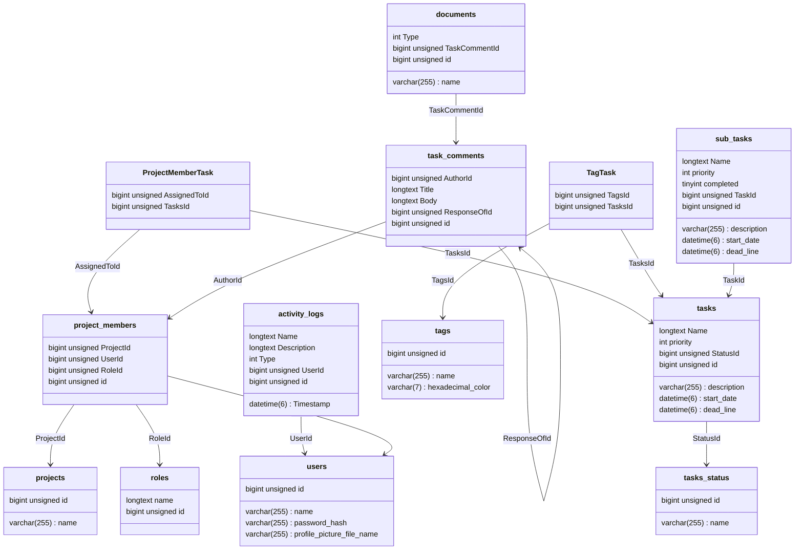

```mermaid
classDiagram
    class ProjectMemberTask {
        bigint unsigned AssignedToId
        bigint unsigned TasksId
    }
    class TagTask {
        bigint unsigned TagsId
        bigint unsigned TasksId
    }
    class activity_logs {
        longtext Name
        longtext Description
        int Type
        bigint unsigned UserId
        datetime(6) Timestamp
        bigint unsigned id
    }
    class documents {
        varchar(255) name
        int Type
        bigint unsigned TaskCommentId
        bigint unsigned id
    }
    class project_members {
        bigint unsigned ProjectId
        bigint unsigned UserId
        bigint unsigned RoleId
        bigint unsigned id
    }
    class projects {
        varchar(255) name
        bigint unsigned id
    }
    class roles {
        longtext name
        bigint unsigned id
    }
    class sub_tasks {
        longtext Name
        varchar(255) description
        datetime(6) start_date
        datetime(6) dead_line
        int priority
        tinyint completed
        bigint unsigned TaskId
        bigint unsigned id
    }
    class tags {
        varchar(255) name
        varchar(7) hexadecimal_color
        bigint unsigned id
    }
    class task_comments {
        bigint unsigned AuthorId
        longtext Title
        longtext Body
        bigint unsigned ResponseOfId
        bigint unsigned id
    }
    class tasks {
        longtext Name
        varchar(255) description
        datetime(6) start_date
        datetime(6) dead_line
        int priority
        bigint unsigned StatusId
        bigint unsigned id
    }
    class tasks_status {
        varchar(255) name
        bigint unsigned id
    }
    class users {
        varchar(255) name
        varchar(255) password_hash
        varchar(255) profile_picture_file_name
        bigint unsigned id
    }

    ProjectMemberTask  -->  project_members : AssignedToId
    ProjectMemberTask  -->  tasks : TasksId
    TagTask  -->  tags : TagsId
    TagTask  -->  tasks : TasksId
    activity_logs  -->  users : UserId
    documents  -->  task_comments : TaskCommentId
    project_members  -->  projects : ProjectId
    project_members  -->  roles : RoleId
    project_members  -->  users : UserId
    sub_tasks  -->  tasks : TaskId
    task_comments  -->  project_members : AuthorId
    task_comments  -->  task_comments : ResponseOfId
    tasks  -->  tasks_status : StatusId
```